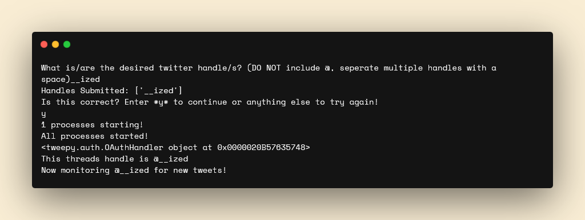

# twitter-monitor
</img>
Monitors Twitter for new tweets with filter capabilities, lightning-fast using Tweepy's Stream API
 - Multithreaded (can monitor multiple handles without having to run the script multiple times!)
 - Built-in URL expander! (sent after initial tweet, expands typical t.co link into more funcitonal format)
 - Built-in methods for sending data to Discord Webhook
 - Simple template for further refinement/editing to your usecase!

Applications from just being a twitter feed away from twitter, to a monitor for time-sensitive information such as exclusive product releases, to even data collection for dataset creation for training deep-learning models. It all starts with data!

**Get Started:**
See [Wiki](https://github.com/izedout/twitter-monitor/wiki/Home)

To Be Added:
 - Keywords (Easy to implement)
     - Keyword file to store keywords in
 - File-stored twitter handles
 - Logging/data collection
     - Documenting all tweets in a database format such as JSON for use in AI training projects (super not Twitter approved but we have workarounds)
     - Options to record additional information such as time, twitter handle, twitter name, bio, # of likes, retweets and comments
 - Highly-customizable filter system
 - Simultaneous API and non-API implementations (to get tweet the fastest, operate while twitter dev keys arent available, but still have access to private accounts, etc etc
 - Monitor keywords across all of twitter (simple terms, hashtags)
 - Remote operation via webapp

Feel free to leave more feature suggestions as issues :)

**Build:**
See [Wiki](https://github.com/izedout/twitter-monitor/wiki/Build)

*I am not responsible if this is in any way abusing the Twitter API and resulting in you getting your developer account closed.* In its current state it does not collect data or abuse get requests, and the stream API is supported by them because it it less resource intensive, so I think they should be cool with it :) 

***DONT COLLECT DATA WITHOUT TWITTER's EXPLICIT PERMISSION!!! Its likely illegal, and can lead to more limited API's in future :(***

*But at the same time people who tweet on public accounts should know that their data may as well be public domain, do you own *
